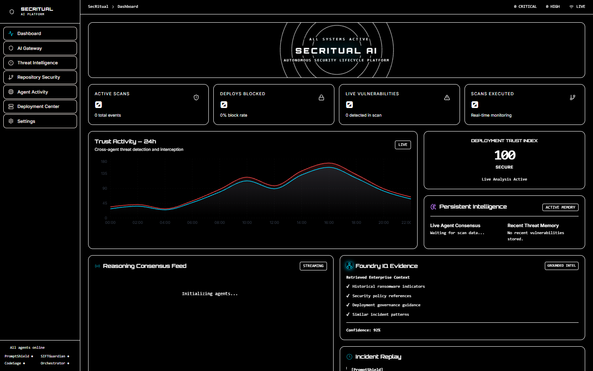
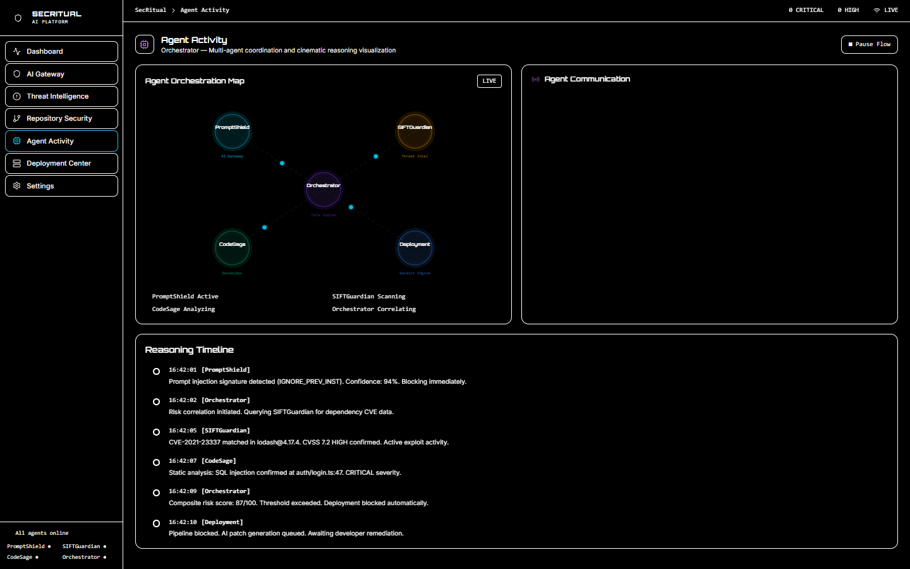
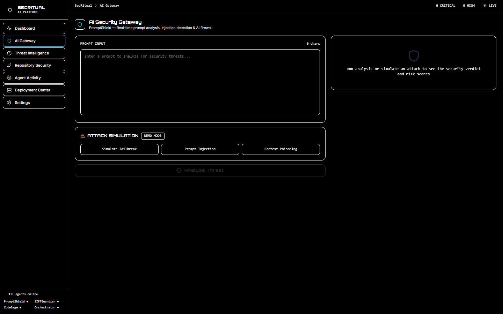
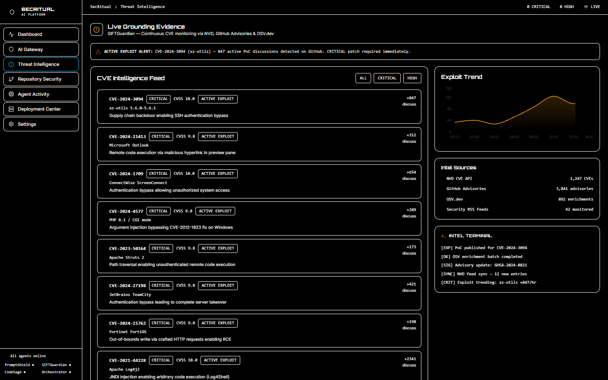
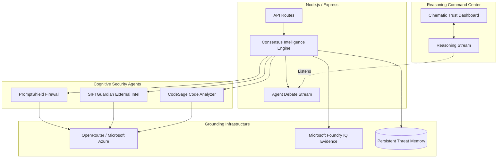

# 🛡️ SecRitual AI
**From Risk to Reason — Grounded AI Security Intelligence.**

> **A Grounded AI Security Reasoning & Trust Orchestration Platform powered by Microsoft Foundry IQ, GitHub Copilot, and Multi-Agent Consensus.**


<br>


Built for the Microsoft Agents League Hackathon to demonstrate how AI can securely reason about deployment trust, risk paths, and governance before code ever reaches production.

SecRitual AI is an **explainable security decision engine** that orchestrates multiple autonomous agents to reason over AI prompts, LLM workflows, and code repositories. Instead of merely surfacing alerts, SecRitual acts as an **"AI Security Courtroom"**—where agents debate risk, synthesize confidence, and validate deployment integrity to produce context-aware, evidence-backed verdicts.

**SecRitual AI grounds the entire security lifecycle:**  
`Prompt Analysis → Agent Debate → Risk Grounding → Deployment Trust Verdict`

---

## 🌍 Why SecRitual AI Matters

Modern AI systems face complex, interlocking risks:
- Prompt injection attacks
- Jailbreak manipulation
- Supply chain vulnerabilities
- Hallucinated security justifications

Traditional security tooling passively monitors. SecRitual AI introduces **Explainable Risk Intelligence**, a system where AI agents actively synthesize deployment consensus, guaranteeing that every security decision is backed by human-readable rationale and enterprise-aware evidence.

---

## 🧩 The Centerpiece: Agent Debate

SecRitual AI distributes security cognition across specialized agents that disagree, challenge assumptions, and justify evidence. This is the emotional core of the platform: multiple AI security experts reasoning together to determine deployment safety.

The system synthesizes these reasoning streams to generate a **Deployment Trust Index**—ensuring that every decision to block or pass a deployment is fully explainable, transparent, and enterprise-validated.

---

## ✨ Key Capabilities

- **Multi-Agent Security Debate & Consensus**
- **Explainable Deployment Rationale**
- **AI Prompt Injection Defense**
- **Foundry IQ Contextual Evidence Retrieval**
- **Deployment Trust Orchestration**
- **AI Governance & Compliance Validation**
- **Cinematic Reasoning Streams**
- **Persistent AI Security Memory**

---

## 🏆 Hackathon Alignment

SecRitual AI was built specifically to demonstrate the power of **Multi-Step Reasoning Agents** and **Microsoft AI Ecosystems**:

* 🧠 **Reasoning Agents Track**: Features a true multi-agent debate mode where agents (PromptShield, CodeSage, SIFTGuardian) detect threats, correlate risks, and synthesize a trust consensus before generating a deployment verdict.
* 🌐 **Microsoft Foundry IQ Integration**: Utilizes Foundry IQ context-aware intelligence retrieval to ensure deployment reasoning is backed by enterprise-grade security evidence (e.g. historical ransomware indicators).
* 🛡️ **Reliability & Safety**: Evaluates trust and validates deployment decisions to guarantee AI safety and prevent the execution of malicious code or prompts.
* 💻 **AI-Assisted Development**: Built rapidly using GitHub Copilot and agentic workflows.

---

## 🤖 The Reasoning Agents

SecRitual AI orchestrates four specialized intelligence units that participate in the "Security Courtroom":

1. **PromptShield**: The AI Firewall. Reason about and intercept prompt injections, jailbreaks, and PII leaks.
2. **SIFTGuardian**: The Threat Intelligence engine. Correlates dependency vulnerabilities with real-time exploit chatter to provide external evidence.
3. **CodeSage**: The DevSecOps AST analyzer. Performs deep code reasoning to generate safe, explainable remediation patches.
4. **Orchestrator**: The "Judge". Synthesizes the agent debate, validates the evidence through Microsoft Foundry IQ, evaluates overall trust, and dictates the final explainable `BLOCK` or `PASS` deployment verdict.

---

## 🚨 Trust Convergence & Deployment Governance

SecRitual AI dynamically evaluates the Deployment Trust Index based on reasoning streams:

`SAFE` → `ELEVATED` → `HIGH` → `CRITICAL`

As agents debate prompt attacks, exploit telemetry, and vulnerable dependencies, the deployment trust converges in real-time, providing an explainable risk matrix to human operators.

### 🎙️ Live Reasoning Consensus
When a threat is introduced, the agents debate in a live reasoning stream:
```log
[PromptShield]
Confidence 94%: Prompt injection signature detected (IGNORE_PREV_INST).

[SIFTGuardian]
Corroborating external risk: Exploit activity correlated with express@4.18.2.

[CodeSage]
Internal risk path identified: Authentication middleware is vulnerable to injection.

[Orchestrator]
Synthesizing debate. Foundry IQ confirms payload matches historical ransomware signatures.
Trust threshold breached. Evidence dictates immediate deployment halt.

[Trust Governance Engine]
Deployment verdict: BLOCK
Rationale: High-confidence injection chain supported by external vulnerability chatter.
```

---

## 🎬 The Winning Demo Flow

Our demo tells a cinematic story of trust orchestration and AI governance:

1. **Upload Vulnerable Repo**: Initialize the cognitive reasoning process on a target codebase.
2. **Simulate Malicious Prompt**: Trigger a live prompt injection attempt (`IGNORE_PREV_INST`).
3. **Threat Intelligence Activates**: SIFTGuardian surfaces external evidence for `express@4.18.2`.
4. **Agents Debate in Realtime**: Watch the reasoning streams as the agents challenge assumptions and correlate the composite risk.
5. **Trust Level Plummets**: The Security Trust Matrix visualizes the dropping confidence; the UI begins pulsing red.
6. **Foundry IQ Grounding**: The Orchestrator validates the risk using Microsoft Foundry IQ's historical telemetry, ensuring zero hallucination.
7. **Consensus Reached**: The Orchestrator dictates a grounded `BLOCK` verdict.
8. **Deployment Blocked**: The pipeline halts. A comprehensive Explanation of Risk and Business Impact narrative is generated for human review.
9. **AI Remediation**: CodeSage generates an explainable, drop-in patch to neutralize the SQL injection risk.
10. **Deployment Approved**: Post-patch, trust is restored, and the pipeline proceeds safely.

---

## 📸 Platform Interface

> **Note to judges/developers:** *Screenshot placements for the final submission.*

### 🖥️ Trust Orchestration Dashboard


### 🎬 Agent Debate & Consensus


### 🛡️ AI Gateway Reasoning


### 🌐 Threat Intelligence Grounding


---

## 🏛️ System Architecture

SecRitual AI operates as an explainable security cognition system using Server-Sent Events (SSE) to visualize live reasoning streams.

### 🧠 Core Trust Principles

SecRitual AI was designed to answer the question: *"How does AI reason about trust, safety, and deployment integrity?"*
- **Explainable security cognition**
- **Evidence-backed verdicts**
- **Enterprise-aware Foundry IQ grounding**
- **Live agent debate and consensus generation**
- **Human-supervised compliance alignment**



### ⚙️ Technical Highlights

- **Multi-agent reasoning and consensus intelligence**
- **Live SSE reasoning stream visualizations**
- **Foundry IQ contextual evidence grounding**
- **Explainable deployment risk narratives**
- **Persistent AI security memory**

### 🛠️ Technology Stack

- **Frontend**: React 18, Vite, TailwindCSS, Framer Motion, Recharts.
- **Trust Layer**: Node.js, Express, Server-Sent Events (SSE).
- **Cognition Engine**: OpenRouter API Key (leveraging Azure-hosted model routing and enterprise AI orchestration), Ollama (Local fallback).
- **Grounding**: Microsoft Foundry IQ integration for contextual threat evidence.
- **Database**: Supabase (PostgreSQL) for persistent audit logs and memory.

---

## 🚀 Getting Started

### Prerequisites
* Node.js v18+
* `pnpm` workspace manager
* Supabase (for persistent threat memory)
* OpenRouter API Key

### 1. Setup the Trust Engine (Backend)
```bash
cd apps/backend
npm install
cp .env.example .env
# Add your OPENROUTER_API_KEY and SUPABASE_URL
npm run dev
```

### 2. Setup the Command Center (Frontend)
```bash
cd apps/frontend
npm install
npm run dev
```

### 3. Database Schema
Execute the `apps/backend/supabase_schema.sql` file in your Supabase SQL editor to initialize the `threat_memory`, `deployment_history`, and `agent_logs` tables with proper RLS policies for audit logging.

---

## 🚀 Future Roadmap

- Automated compliance alignment checks (SOC2, HIPAA)
- SOC/Executive-readable reasoning summaries
- AI hallucination confidence scoring
- Slack / Teams deployment governance alerts
- Manual approval gating and risk override

---

## 🌌 Vision

SecRitual AI represents a future where AI does not simply monitor metrics—it actively reasons about trust.

By combining AI debate, contextual evidence retrieval, and consensus intelligence, SecRitual AI transforms cybersecurity from reactive infrastructure monitoring into a proactive, explainable **AI Security Courtroom**. 

SecRitual AI validates deployment decisions in logic, ensuring that the AI revolution proceeds with absolute trust and transparency.

---

## 📄 License

This project is licensed under the [MIT License](LICENSE).